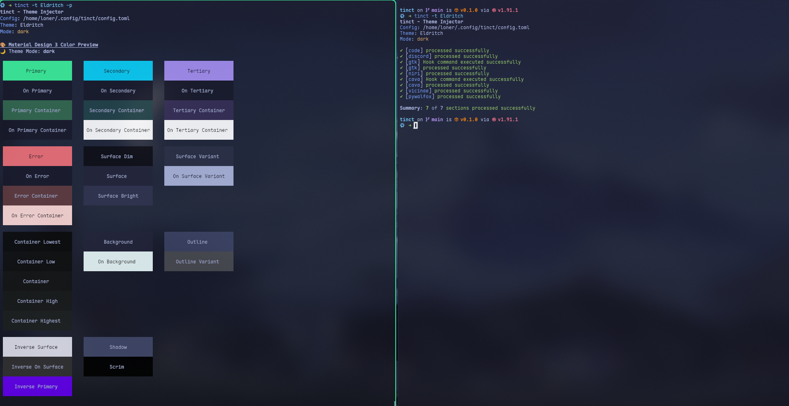

# tinct - Theme Injector

A theme injector tool that applies Material Design 3 color palettes to various configuration files.



## Description

tinct is a command-line utility that generates themed configuration files based on Material Design 3 color specifications. It reads color themes from JSON files and injects the appropriate color values into template files, producing themed output files for various applications.

## Features

- Material Design 3 compliant color generation
- Support for light and dark themes
- Template-based theme injection
- Color preview functionality
- Configurable via TOML files
- Support for post-processing hooks

## Installation

### 1. Build from source

```bash
git clone https://github.com/lonerOrz/tinct.git
cd tinct
cargo build --release
```

### 2. Install via Nix (for Nix or NixOS users)

```bash
{
  inputs = {
    nixpkgs.url = "github:nixos/nixpkgs/nixos-unstable";
    flake-utils.url = "github:numtide/flake-utils";
    tinct.url = "github:lonerOrz/tinct";
  };

  outputs =
    inputs@{
      self,
      flake-utils,
      nixpkgs,
      ...
    }:
    flake-utils.lib.eachDefaultSystem (
      system:
      let
        pkgs = import nixpkgs {
          inherit system;
        };
      in
      {
        devShells.default = pkgs.mkShell {
          packages = [ inputs.tinct.packages.${system}.tinct ];
        };
      }
    );
}
```

## Usage

Basic usage:

```bash
tinct --theme <theme-name>
```

With custom options:

```bash
tinct -t MyTheme -c config.toml -m light -p
```

Options:

- `-c, --config`: Path to the TOML config file (defaults to `~/.config/tinct/config.toml`)
- `-t, --theme`: Path to theme.json file or theme name in themes/ folder
- `-m, --mode`: Theme mode override (dark/light, defaults to dark)
- `-p, --preview`: Show color preview instead of processing templates
- `--log-level`: Logging level (quiet/normal/verbose, defaults to normal)

## License

BSD 3-Clause License

---

> If you find `tinct` useful, please give it a ⭐ and share! 🎉
