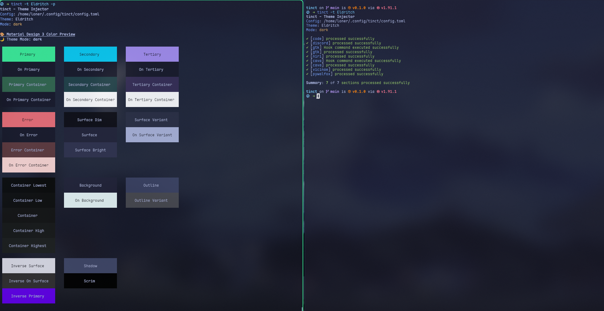

# tinct - Theme Injector

`tinct` generates a Material Design 3 (Material You) palette from a seed colour,
a theme JSON file, or a wallpaper image, then injects it into template files to
produce themed configuration files. Light and dark themes are both supported.



## Features

- **Material You palettes** — built with the official MD3 algorithms from a single seed.
- **Three colour sources** — `--seed <hex>`, `--theme <file>`, or `--image <wallpaper>`.
- **Scheme selection** — `--scheme-type` picks the variant for every source: `tonal-spot`, `vibrant`, `faithful`, `muted`, `dysfunctional`, `content`, `fruit-salad`, `rainbow`, `monochrome`. For images it also selects the extraction pipeline.
- **Input-aware terminal palette** — the 16 ANSI colours are derived from your input via a wallust-inspired CIE LCh pipeline, not a fixed rainbow.
- **Parallel template injection** with per-template output paths and optional post-hooks.
- **Preview mode** — `-p` prints the palette instead of writing files.
- **TOML configuration** — every option is optional; a commented default config is generated on first run.

## Installation

### Build from source

```bash
git clone https://github.com/lonerOrz/tinct.git
cd tinct
cargo build --release
```

### Nix / NixOS

```nix
{
  inputs = {
    nixpkgs.url = "github:nixos/nixpkgs/nixos-unstable";
    flake-utils.url = "github:numtide/flake-utils";
    tinct.url = "github:lonerOrz/tinct";
  };

  outputs = { self, nixpkgs, flake-utils, tinct }:
    flake-utils.lib.eachDefaultSystem (system:
      let pkgs = import nixpkgs { inherit system; };
      in {
        devShells.default = pkgs.mkShell {
          packages = [ tinct.packages.${system}.tinct ];
        };
      });
}
```

## Usage

Exactly one of `--theme`, `--seed`, `--image` is required.

```bash
tinct --theme MyTheme              # theme.json path or name in themes/
tinct --seed "#7aa2f7"             # generate from a seed colour
tinct --image wallpaper.png        # extract colours from a wallpaper
tinct -t TokyoNight -m light -p    # preview the light palette
```

| Option                   | Description                                                                                                  |
| ------------------------ | ------------------------------------------------------------------------------------------------------------ |
| `-c, --config <FILE>`    | Config file. Defaults to `$XDG_CONFIG_HOME/tinct/config.toml`, falling back to `~/.config/tinct/config.toml` |
| `-t, --theme <THEME>`    | Path to a theme.json file, or a theme name in `themes/`                                                      |
| `-s, --seed <HEX>`       | Seed colour, e.g. `"#7aa2f7"`                                                                                |
| `-i, --image <IMAGE>`    | Wallpaper image (PNG/JPG/WebP)                                                                               |
| `-m, --mode <MODE>`      | `dark` (default) or `light`                                                                                  |
| `-p, --preview`          | Print the palette instead of processing templates                                                            |
| `--scheme-type <SCHEME>` | MD3 scheme variant (and image extraction pipeline)                                                           |
| `--skip-sequences`       | Do not emit ANSI escape sequences to update the terminal                                                     |
| `--log-level <LEVEL>`    | `quiet`, `normal` (default), or `verbose`                                                                    |

## Configuration

The config file lives at `$XDG_CONFIG_HOME/tinct/config.toml` (fallback
`~/.config/tinct/config.toml`) and holds template definitions plus algorithm,
image, and terminal tuning. Every key has a built-in default, so a partial config
— or none of the optional sections — is valid.

On first run, if the default config is missing, `tinct` writes a fully commented
default there, prints its path, and exits. An explicit `--config <path>` that does
not exist is an error: `tinct` never writes to a path you did not ask for.

Relative `input_path` / `output_path` values resolve against the config file's
directory, so behaviour is identical regardless of the working directory. `~` is
expanded.

### 1. Templates

```toml
[templates.alacritty]
input_path = "~/.config/tinct/templates/alacritty.toml"
output_path = "~/.config/alacritty/alacritty.toml"
post_hook = "echo 'Alacritty theme injected successfully!'"

[templates.waybar]
input_path = "~/.config/tinct/templates/waybar.css"
output_path = "~/.config/waybar/style.css"
post_hook = "killall -SIGUSR2 waybar"
```

| Option        | Required | Description                                                                                  |
| ------------- | -------- | -------------------------------------------------------------------------------------------- |
| `input_path`  | yes      | Template file to read (relative paths resolve against the config directory)                  |
| `output_path` | yes      | File to write the rendered result to                                                         |
| `post_hook`   | no       | Command run after writing; supports `{{output_file}}`, and a `./script` is executed directly |

### 2. Algorithm

```toml
[algorithm]
hue_shift = 0
saturation_adjustment = 0
contrast_level = 0.0
```

| Parameter               | Range       | Default | Effect                                                       |
| ----------------------- | ----------- | ------- | ------------------------------------------------------------ |
| `hue_shift`             | -180 ~ 180  | `0`     | Rotates the seed hue before generation                       |
| `saturation_adjustment` | -100 ~ 100  | `0`     | Scales seed chroma (`-100` → grey, `+100` → double)          |
| `contrast_level`        | -1.0 ~ 1.0  | `0.0`   | MD3 contrast level for accessibility                         |
| `seed_tone`             | 0 ~ 100     | unset   | Forces the seed's HCT tone before generation                 |
| `chroma_floor`          | 0 ~ 120     | `0`     | Minimum seed chroma; grey seeds still yield a lively palette |
| `variant_dark`          | scheme name | unset   | MD3 variant used in dark mode only                           |
| `variant_light`         | scheme name | unset   | MD3 variant used in light mode only                          |

These parameters only **nudge the seed**. Every secondary/tertiary/neutral/error
relationship comes from the selected MD3 scheme, which is what keeps the output
faithful to Material You.

`color_harmony` (analogous, complementary, …) is **deprecated and ignored** — the
old hue-table relationships were not part of MD3. Use `--scheme-type` /
`[image].scheme_type` instead.

### 3. Image extraction

The selected scheme is also used to generate the palette:

```toml
[image]
scheme_type = "tonal-spot"
```

| Scheme          | Extraction pipeline     | MD3 variant | Description              |
| --------------- | ----------------------- | ----------- | ------------------------ |
| `tonal-spot`    | Wu + WSMeans + Score    | Tonal Spot  | MD3 standard, balanced   |
| `vibrant`       | K-means + Chroma        | Vibrant     | High saturation colours  |
| `faithful`      | K-means + Count         | Fidelity    | Area-dominant colours    |
| `muted`         | K-means + Muted         | Neutral     | Low saturation, subtle   |
| `dysfunctional` | K-means + Dysfunctional | Expressive  | 2nd most dominant family |
| `content`       | Wu + WSMeans + Score    | Content     | MD3 Content variant      |
| `fruit-salad`   | Wu + WSMeans + Score    | Fruit Salad | MD3 Fruit Salad variant  |
| `rainbow`       | Wu + WSMeans + Score    | Rainbow     | MD3 Rainbow variant      |
| `monochrome`    | Wu + WSMeans + Score    | Monochrome  | MD3 Monochrome variant   |

| Option           | Range                            | Default   | Effect                                            |
| ---------------- | -------------------------------- | --------- | ------------------------------------------------- |
| `max_colors`     | 1+                               | `32`      | Cap on returned colour clusters                   |
| `min_population` | 0.0 ~ 1.0                        | `0.0`     | Drop clusters below this fraction of total pixels |
| `filter`         | `none`/`saturation`/`brightness` | `none`    | Pre-filter pixels before clustering               |
| `quantizer`      | `wsmeans`/`wu`                   | `wsmeans` | `wu` skips WSMeans refinement (faster, coarser)   |

**Scheme precedence:** CLI `--scheme-type` > `[image].scheme_type` > `tonal-spot`.
`variant_dark` / `variant_light` then override that base for the respective mode.

The resolved scheme applies to **every** source — seeds and theme files too, not
just images. For the non-M3 names the name does double duty; e.g.
`--image w.png --scheme-type faithful` extracts area-dominant colours then builds
the `Fidelity` palette, while `--seed "#6750A4" --scheme-type faithful` skips
extraction and builds `Fidelity` directly.

### 4. Terminal palette (ANSI)

UI/MD3 roles are always pure Material You. A terminal needs 16 _recognizable_
colours, so the ANSI palette is generated separately with a CIE LCh pipeline in
the spirit of [wallust](https://codeberg.org/explosion-mental/wallust)
(MIT © explosion-mental):

```toml
[ansi]
palette = "dark"
source_weight = 0.6667
chroma_threshold = 12.0
brightness_delta = 8.0
bright_chroma_multiplier = 1.2
contrast_target = 3.0
# [ansi.anchors]   # power-user: override individual hue anchors, e.g. red = "#E06C75"
```

| Option                      | Range          | Default  | Effect                                                   |
| --------------------------- | -------------- | -------- | -------------------------------------------------------- |
| `palette`                   | `dark`/`light` | `dark`   | Bright variants get lighter (`dark`) or darker (`light`) |
| `source_weight`             | 0.0 ~ 1.0      | `0.6667` | Blend between the fixed anchor and the source hue        |
| `chroma_threshold`          | 0+             | `12.0`   | Ignore source candidates below this chroma               |
| `brightness_delta`          | 0+             | `8.0`    | Lightness shift for bright variants                      |
| `bright_chroma_multiplier`  | 0+             | `1.2`    | Chroma multiplier for bright variants                    |
| `contrast_target`           | 0.0 ~ 21.0     | `3.0`    | Minimum contrast ratio against the background            |
| `background` / `foreground` | hex colour     | unset    | Pin ANSI black (0) / white (7)                           |
| `anchors.<hue>`             | hex colour     | unset    | Override an individual hue anchor                        |

Setting `contrast_target = 0.0` disables the contrast nudge; `source_weight = 0.0`
reproduces fixed, wallust-like anchors. All values are clamped to their valid range.

#### How the ANSI colours are derived

The chromatic slots come from your input, not a fixed palette:

| Source            | Candidate colours                                            |
| ----------------- | ------------------------------------------------------------ |
| `--image <path>`  | the representative clusters extracted from the wallpaper     |
| `-t <theme.json>` | **every hex value in the theme file**, including custom keys |
| `--seed <hex>`    | the seed colour only                                         |

Each candidate snaps to the chromatic slot whose hue range contains it (red
0–60°, yellow 61–120°, green 121–180°, cyan 181–210°, blue 211–300°, magenta
301–360°). The slot keeps the source **hue** and blends its chroma/lightness with
the slot's vivid anchor using wallust's `(anchor + 2·average) / 3` weighting. A slot
with no matching candidate falls back to the **full anchor**, so a monochrome input
never collapses into a washed-out palette. Near-neutral candidates are ignored, and
each is consumed by at most one slot.

- `black` / `bright_black` / `white` / `bright_white` — a greyscale ladder from the
  scheme's neutral palette, so backgrounds and text always match the mode.
- `red` … `cyan` — the six chromatic slots described above.
- `bright_*` — the same hue as their normal counterpart, but lighter and higher
  chroma, so they read as vivid emphasis rather than muddy.

Every chromatic slot is gamut-mapped back to sRGB and then nudged in lightness
until it clears the `contrast_target` against the terminal background.

## Theme format

A theme is a JSON file. Three shapes are accepted; names are case-insensitive
(`"primary"` or `"Primary"`).

**Seed only (simplest):**

```json
{ "seed": "#7aa2f7" }
```

**Overrides only** — `Primary` is used as the seed:

```json
{ "Primary": "#7aa2f7", "Secondary": "#bb9af7", "Tertiary": "#9ece6a" }
```

**Seed + overrides (recommended):**

```json
{
  "seed": "#7aa2f7",
  "Primary": "#7aa2f7",
  "Secondary": "#bb9af7",
  "Tertiary": "#9ece6a",
  "Error": "#f7768e",
  "Surface": "#1a1b26",
  "Background": "#1a1b26"
}
```

`seed` sets the generation seed; any other key overrides the generated role.

| Field              | Description                        | Example       |
| ------------------ | ---------------------------------- | ------------- |
| `seed`             | Seed colour for palette generation | `"#7aa2f7"`   |
| `Primary`          | Override primary colour            | `"#7aa2f7"`   |
| `Secondary`        | Override secondary colour          | `"#bb9af7"`   |
| `Tertiary`         | Override tertiary colour           | `"#9ece6a"`   |
| `Error`            | Override error colour              | `"#f7768e"`   |
| `Surface`          | Override surface colour            | `"#1a1b26"`   |
| `Background`       | Override background colour         | `"#1a1b26"`   |
| `SurfaceVariant`   | Override surface variant           | `"#24283b"`   |
| `Outline`          | Override outline colour            | `"#565f89"`   |
| `OutlineVariant`   | Override outline variant           | `"#b4b5b9"`   |
| `Shadow`           | Override shadow colour             | `"#000000"`   |
| `Scrim`            | Override scrim colour              | `"#00000080"` |
| `InverseSurface`   | Override inverse surface           | `"#ebdbb2"`   |
| `InverseOnSurface` | Override inverse on surface        | `"#3c3836"`   |
| `InversePrimary`   | Override inverse primary           | `"#7aa2f7"`   |

## Template reference

Placeholders use the form `{{colors.<role>.<mode>.<attribute>}}`, plus the
mode helpers below.

### Colour roles

**MD3 / UI roles** (pure Material You):

- **primary family** — `primary`, `on_primary`, `primary_container`, `on_primary_container`
- **secondary family** — `secondary`, `on_secondary`, `secondary_container`, `on_secondary_container`
- **tertiary family** — `tertiary`, `on_tertiary`, `tertiary_container`, `on_tertiary_container`
- **error family** — `error`, `on_error`, `error_container`, `on_error_container`
- **background** — `background`, `on_background`
- **surface** — `surface`, `on_surface`, `surface_variant`, `on_surface_variant`, `surface_dim`, `surface_bright`, `surface_container_lowest`, `surface_container_low`, `surface_container`, `surface_container_high`, `surface_container_highest`
- **inverse** — `inverse_surface`, `inverse_on_surface`, `inverse_primary`
- **outline** — `outline`, `outline_variant`
- **other** — `shadow`, `scrim`

**Terminal ANSI roles** — the 16 slots described in
[Terminal palette (ANSI)](#4-terminal-palette-ansi): `black`, `red`, `green`,
`yellow`, `blue`, `magenta`, `cyan`, `white`, and their `bright_*` counterparts.

### Format attributes

| Attribute     | Example Placeholder                        | Output Example             |
| ------------- | ------------------------------------------ | -------------------------- |
| Hex complete  | `{{colors.primary.default.hex}}`           | `#ff5722`                  |
| Hex stripped  | `{{colors.primary.default.hex_stripped}}`  | `ff5722`                   |
| Hex8 complete | `{{colors.primary.default.hex8}}`          | `#ff5722ff`                |
| Hex8 stripped | `{{colors.primary.default.hex8_stripped}}` | `ff5722ff`                 |
| RGB           | `{{colors.primary.default.rgb}}`           | `rgb(255, 87, 34)`         |
| RGBA          | `{{colors.primary.default.rgba}}`          | `rgba(255, 87, 34, 1.0)`   |
| Red           | `{{colors.primary.default.red}}`           | `255`                      |
| Green         | `{{colors.primary.default.green}}`         | `87`                       |
| Blue          | `{{colors.primary.default.blue}}`          | `34`                       |
| Alpha         | `{{colors.primary.default.alpha}}`         | `1.0`                      |
| HSL           | `{{colors.primary.default.hsl}}`           | `hsl(14, 100%, 57%)`       |
| HSLA          | `{{colors.primary.default.hsla}}`          | `hsla(14, 100%, 57%, 1.0)` |
| Hue           | `{{colors.primary.default.hue}}`           | `14`                       |
| Saturation    | `{{colors.primary.default.saturation}}`    | `100`                      |
| Lightness     | `{{colors.primary.default.lightness}}`     | `57`                       |

### Filters

> **Syntax:** do not put whitespace directly after the pipe. Use
> `{{colors.primary.default.rgba|set_alpha:0.5}}`, not `| set_alpha`.

| Filter     | Example Placeholder                              | Output                    |
| ---------- | ------------------------------------------------ | ------------------------- |
| Set Alpha  | `{{colors.primary.default.rgba\|set_alpha:0.5}}` | `rgba(255, 87, 34, 0.5)`  |
| Lighten    | `{{colors.primary.default.rgb\|lighten:10}}`     | Lightened RGB colour      |
| Darken     | `{{colors.primary.default.rgb\|darken:10}}`      | Darkened RGB colour       |
| Saturate   | `{{colors.primary.default.rgb\|saturate:10}}`    | More saturated RGB colour |
| Desaturate | `{{colors.primary.default.rgb\|desaturate:10}}`  | Less saturated RGB colour |

For transparency you can also format the channels manually:

```css
.semi-transparent-overlay {
  background-color: rgba(
    {{colors.surface.default.red}},
    {{colors.surface.default.green}},
    {{colors.surface.default.blue}},
    0.8
  );
}
```

### Mode placeholders

- `{{mode}}` → `"dark"` or `"light"`
- `{{is_dark}}` → `"true"` or `"false"`
- `{{is_light}}` → `"true"` or `"false"`

### Examples

```css
.primary-button {
    background-color: {{colors.primary.default.hex}};
    color: {{colors.on_primary.default.hex}};
}

.accent-element {
    background-color: {{colors.tertiary.default.hsl}};
}

.styled-border {
    border-color: #{{colors.outline.default.hex_stripped}};
}

@media (prefers-color-scheme: {{mode}}) {
    body {
        background-color: {{colors.background.default.hex}};
    }
}
```

## License

BSD 3-Clause License.

---

> If you find `tinct` useful, please give it a ⭐ and share! 🎉
